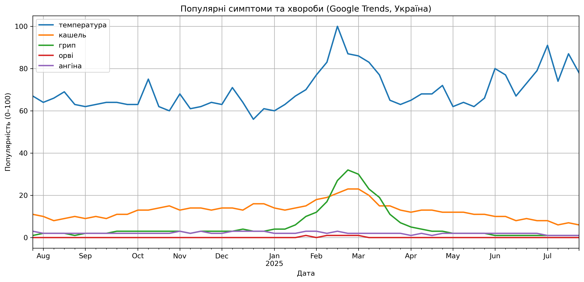
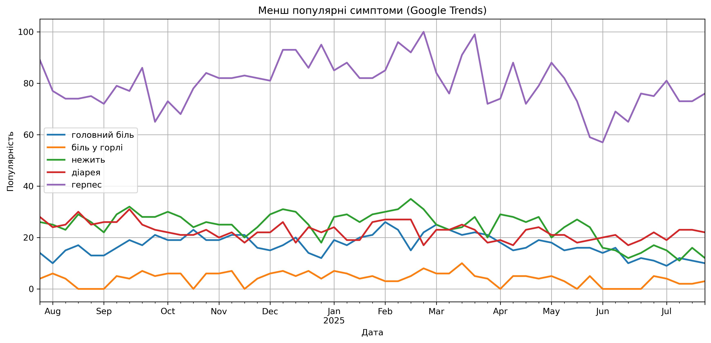
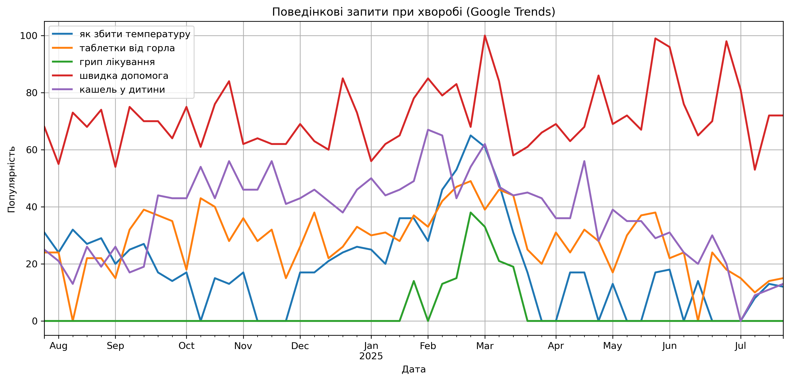

# Аналіз медичних запитів в Google Trends (Україна, 2024–2025)

Цей pet-проєкт демонструє, як за допомогою відкритих даних Google Trends можна досліджувати сезонність симптомів, поведінку користувачів при нездужанні та патерни пошуку медичної допомоги в Україні.

## Мета проєкту

- Дослідити, які симптоми захворювань найбільш популярні серед українців;
- Проаналізувати, які дії користувачі вживають при хворобі (наприклад: “як збити температуру”, “швидка допомога”);
- Показати сезонні та поведінкові тренди на прикладі реальних пошукових даних.

## Використані інструменти

- Python + Jupyter Notebook
- pytrends
- pandas
- matplotlib

## Візуалізації

### 1. Інтерес до симптомів
Пік запитів по "температурі" та "кашлю" спостерігається у зимово-весняний період.

---

### 2. Інші пошукові дії
Низька, але стабільна популярність запитів на кшталт "діарея", "нежить", "біль у горлі". Висока популярність "герпесу"

---

### 3. Поведінкові запити при нездужанні
Запити типу "швидка допомога", "як збити температуру", "кашель у дитини" мають чітко виражену сезонність.

---

## Основні висновки

- Найпопулярніший симптом у запитах — "температура", далі — "кашель" і "біль у горлі".
- Поведінкові запити (особливо пов’язані з дітьми) мають помітні сезонні піки.
- Запити типу "швидка допомога" та "герпес" зберігають високу стабільність протягом року.
- Менш популярні, але важливі запити — це "діарея", "нежить", "біль у горлі".

## Для чого це

Такий підхід можна використати для:
- оцінки медичних трендів;
- створення попереджень у сфері громадського здоров'я;
- маркетингового аналізу в фармацевтичній сфері;
- UX-аналітики для медичних платформ.

---

## Автор

**Валентин Ревич** — аналітик даних з медичним бекграундом.  
[LinkedIn → (https://www.linkedin.com/in/valentyn-revych-6aa275347/?locale=en_US)]
